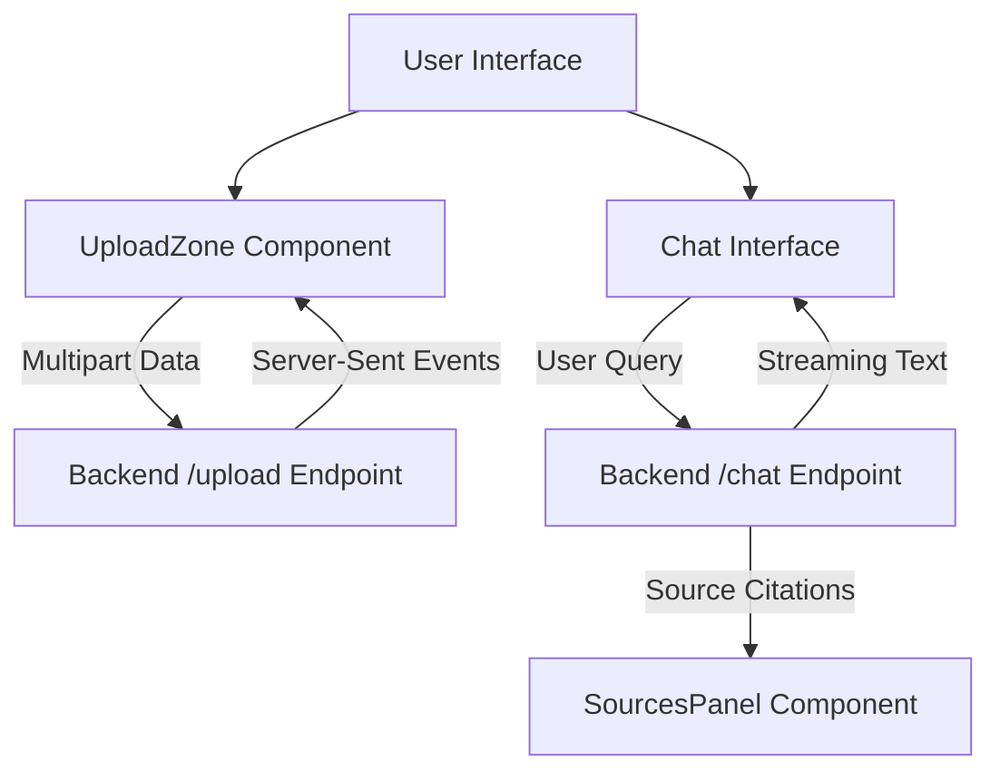

# Document AI Assistant - Frontend

## Overview
This is the frontend user interface for the Document AI Assistant. It is a modern, responsive web application that allows users to upload documents (PDF, DOCX, TXT) and interact with a Retrieval-Augmented Generation (RAG) AI system.

## Technology Stack
- **Framework**: Next.js 16 (App Router)
- **Language**: TypeScript
- **Styling**: Tailwind CSS
- **Animations**: Framer Motion
- **Icons**: Lucide React

## System Architecture



## How the Process Works
1. **Document Upload**: Users upload files via a drag-and-drop interface. The frontend communicates with the backend via a Server-Sent Events (SSE) connection, parsing the real-time stream to display granular progress (e.g., "Extracting text", "Running OCR").
2. **Contextual Chat**: Users query the AI about their uploaded documents. The application receives the AI's response via a token-by-token stream, providing an instantaneous conversational experience.
3. **Source Verification**: Once the AI finishes responding, the frontend parses the citation payload and renders interactive citation links (e.g., `[1]`). When clicked, these links open a dedicated Source Panel displaying the exact paragraph and page number referenced.

## API Integration
The frontend interacts with the backend through the following workflows:
1. `POST /upload`: Transmits `FormData` and consumes the SSE stream for live upload progress.
2. `POST /chat`: Transmits the chat history and consumes the SSE stream for the AI response and exact document citations.
3. `POST /chat/suggestions`: Fetches 4 dynamic, document-aware questions to prepopulate the chat UI based on the newly uploaded document's contents.

## Environment Configuration
Create a `.env.local` file in the root directory:
```ini
# Required: The base URL of your backend API
# For local development: http://localhost:8000
# For production: https://your-backend-url.onrender.com
NEXT_PUBLIC_API_URL=http://localhost:8000
```

## Running the Application
Ensure you have Node.js installed.
```bash
npm install
npm run dev
```
