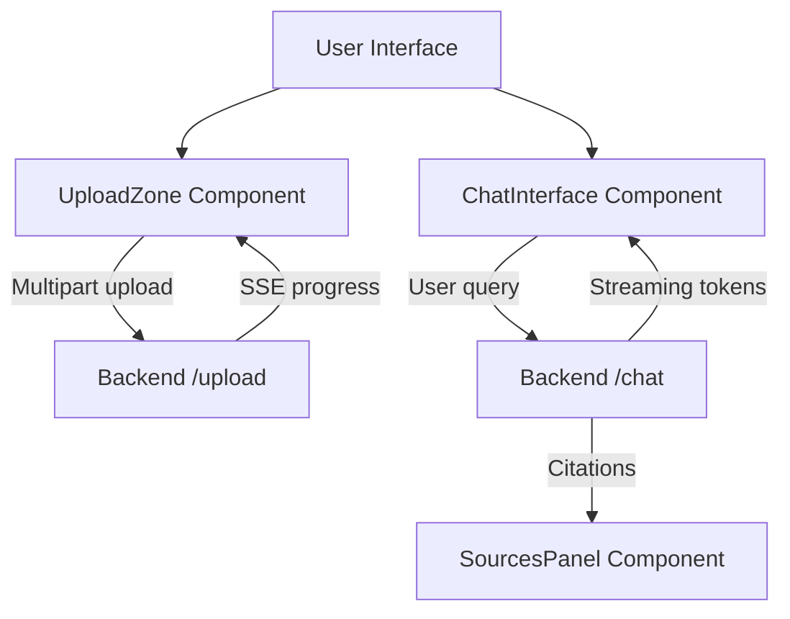

# Document AI Assistant — Frontend

## Overview
The web interface for the Document AI Assistant. Users drag in a PDF, DOCX, or TXT file, then chat with an AI about it. Answers stream in live and include clickable citations that show the exact source paragraph and page.

## Technology Stack
- **Framework**: Next.js 16 (App Router)
- **Language**: TypeScript
- **Styling**: Tailwind CSS
- **Animations**: Framer Motion (+ GSAP on the landing page)
- **Icons**: Lucide React
- **Notifications**: Sonner (toasts)

## System Architecture



## How the Process Works
1. **Upload.** Files are dropped or selected, checked for type and size (max 10 MB) on the client, then sent to the backend. The backend streams progress back over Server-Sent Events, so the user sees live status like "Extracting text" or "Running OCR" with a percentage bar.
2. **Chat.** The user asks a question. The answer streams back token-by-token and is rendered as it arrives (with a typing cursor), so it feels instant. Basic markdown (bold, bullets) and citation markers like `[1]` are rendered inline.
3. **Sources.** After the answer finishes, the backend sends the citations. Each `[1]` in the text becomes a clickable button; clicking it opens the Sources panel and highlights the exact paragraph and page it came from.

## How the Streaming is Read
The backend sends Server-Sent Events. The frontend reads the response body as a stream, buffers partial data, splits on event boundaries, and parses each `data:` line as JSON. It handles three event types from `/chat`:
- `text` — a piece of the answer, appended to the current message.
- `citations` — the source list, attached once the answer is done.
- `error` — a friendly error message, shown as a red error bubble.

## Fallback & Error Handling
The UI is built to stay usable even when things go wrong:

- **Backend URL fallback.** The API base comes from `NEXT_PUBLIC_API_URL`; if it isn't set, it falls back to `http://localhost:8000` for local development.
- **Suggested-questions fallback.** On load, the app asks the backend for 4 document-aware starter questions. If that request fails, it quietly shows four sensible default questions instead — the user never sees a broken state.
- **Server error messages.** When the backend reports it's out of credits, hit a rate limit, or couldn't read an image-only file, that message is displayed directly (as an error bubble in chat, or an error card in the upload panel) with a "Try again" option.
- **Network errors.** If the connection drops, a toast appears ("Network error — please check your connection") and the pending message is marked as failed instead of hanging forever.
- **Empty-response guard.** If a chat request completes without any text coming back, the UI shows a "No response received, please try again" message rather than an empty bubble.
- **Duplicate-send guard.** The input is disabled while a response is streaming, so a question can't be sent twice at once.

## API Integration
- `POST /upload` — sends `FormData`, consumes the SSE stream for live upload progress and the final result.
- `POST /chat` — sends the document IDs and query, consumes the SSE stream for the answer and citations.
- `POST /chat/suggestions` — fetches document-aware starter questions.

## Environment Configuration
Create a `.env.local` file:
```ini
# Base URL of the backend API
# Local:      http://localhost:8000
# Production: https://your-backend.onrender.com   (https, no trailing slash)
NEXT_PUBLIC_API_URL=http://localhost:8000
```
> Note: `NEXT_PUBLIC_*` values are baked in at build time. If you change this in production, you must redeploy for it to take effect.

## Running the Application
Requires Node.js.
```bash
npm install
npm run dev
```
